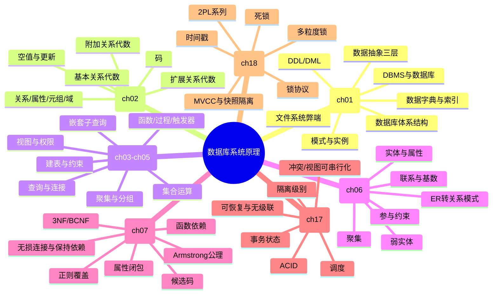

# 数据库系统原理复习总结

整理依据：教师 `复习.pptx`、`试题模拟.pptx`、老师专题资料（SQL、关系代数、ER 图、范式及分解）、可提取文本的复习题 PDF，以及扫描版历年题前几套卷面抽样。

## 一、按重要性排序的课程大纲

| 重要性 | 章节 | 核心内容 | 常见分值/题型 | 复习优先级 |
|---|---|---|---|---|
| 1 | ch03-ch05 SQL | DDL/DML/DCL、查询、连接、聚合、嵌套子查询、视图、约束、函数/过程/触发器 | 应用题 20-30 分，简答若干 | 必须会写 |
| 2 | ch06 ER 模型 | ER 图设计、基数/参与约束、弱实体、联系属性、ER 转关系模式、主码 | 设计题 15-20 分 | 必须会画 |
| 3 | ch02 关系模型与关系代数 | 选择、投影、并/差/交、笛卡儿积、连接、除法、聚集、外连接、更新 | 与 SQL 组合应用，分析题 | 必须会表达 |
| 4 | ch07 关系数据库设计 | 函数依赖、属性闭包、候选码、Armstrong 公理、正则覆盖、3NF/BCNF、无损连接、保持依赖 | 计算/证明题 10-20 分 | 必须会算 |
| 5 | ch17 事务 | ACID、事务状态、调度、冲突/视图可串行化、可恢复/无级联调度、隔离级别 | 简答、分析、判定题 | 高频概念+判定 |
| 6 | ch18 并发控制 | 锁、2PL/严格2PL/强2PL、死锁检测与恢复、多粒度锁、时间戳/MVCC/SI | 简答、分析、调度题 | 当前复习范围明确 |
| 7 | ch01 引言与基本概念 | DBMS、文件系统弊端、数据抽象、模式/实例、数据模型、DDL/DML、数据字典、体系结构、NoSQL | 简答题 2 分小题 | 背关键词 |

卷面风格大致是：简答约 20 分，分析约 20 分，ER 设计约 15-20 分，范式/候选码计算约 10-15 分，SQL+关系代数应用约 30 分。老师复习课件还提示可能有不超过 10 分的发挥题。

## 二、总思维导图



## 三、分章节思维导图与考法

### ch01 引言与基本概念

思维导图：

```text
ch01 基本概念
├─ DBMS：相关数据集合 + 访问数据的程序集合
├─ 文件系统弊端：冗余/不一致、访问困难、数据孤立、完整性、原子性、并发异常、安全性
├─ 数据抽象：物理层、逻辑层、视图层
├─ 模式与实例：逻辑模式、物理模式、子模式；实例是某一时刻的数据状态
├─ 数据模型：关系模型、ER 模型、对象/对象关系、半结构化、层次/网状、NoSQL
├─ 数据库语言：DDL、DML、SQL
├─ 数据库引擎：存储管理、查询处理、事务管理
└─ 补充：数据字典、索引、体系结构、国产数据库
```

会考内容：

| 类型 | 可能题目 |
|---|---|
| 简答 | DDL 和 DML 的含义分别是什么 |
| 简答 | 列举 3 种数据模型 |
| 简答 | 数据库系统相比文件系统的优点/文件系统弊端 |
| 简答 | 什么是数据字典、元数据、索引 |
| 简答/发挥 | 中国有哪些自主设计的数据库：openGauss、OceanBase、TiDB、GaussDB、PolarDB 等 |

答题关键词：数据库系统解决“共享数据的一致、安全、高效、并发、故障恢复”问题。

### ch02 关系模型与关系代数

思维导图：

```text
ch02 关系模型与关系代数
├─ 关系基本概念：关系、元组、属性、域、关系模式、关系实例
├─ 码：超码、候选码、主码、外码
├─ 基本运算：选择 σ、投影 π、并 ∪、差 −、笛卡儿积 ×、更名 ρ
├─ 附加运算：交 ∩、自然连接 ⋈、θ连接、除法 ÷、赋值
├─ 扩展运算：广义投影、聚集 γ、外连接
├─ 空值：unknown、三值逻辑
└─ 数据库修改：插入、删除、更新
```

会考内容：

| 类型 | 可能题目 |
|---|---|
| 应用 | 给出数据库模式，用关系代数表达查询 |
| 应用 | 与 SQL 同时写：Brighton 支行有存款客户、贷款但无账户客户、课程开设差集 |
| 分析 | 判断两个关系代数表达式哪个更优，例如先选择再连接 |
| 证明 | 若两个关系无同名属性，则自然连接等于笛卡儿积 |
| 简答 | 并运算需要满足什么条件：同元、对应属性域相容 |
| 简答 | SQL 中如何表达除法思想：通常用双重 `not exists` |
| 简答 | 自然连接相对等值连接的缺点：自动按所有同名属性连接，容易产生非预期连接 |
| 计算 | 用属性闭包判断某属性集是否为候选码 |

高频模板：

```text
选了所有课程/满足所有条件：
R ÷ S
或 SQL 中 not exists (S except 已满足的集合)

查最大值但不使用聚合：
π_salary(instructor) - π_T.salary(σ_T.salary < S.salary(ρ_T(instructor) × ρ_S(instructor)))
```

### ch03 SQL 基础

思维导图：

```text
ch03 SQL基础
├─ DDL：create table、drop table、alter table
├─ 约束：primary key、foreign key、not null、unique、check
├─ DML：insert、delete、update
├─ 查询：select-from-where、distinct、as、更名
├─ 字符串：like、%、_
├─ 集合运算：union、intersect、except
├─ 空值：is null、unknown、聚集函数忽略 null
├─ 聚集：avg、min、max、sum、count
├─ 分组：group by、having
└─ 嵌套查询：in/not in、some/all、exists/not exists、from 子查询、with、标量子查询
```

会考内容：

| 类型 | 可能题目 |
|---|---|
| 简答 | `varchar` 与 `char` 区别 |
| 简答 | `distinct` 的作用 |
| 简答 | 查询名字中包含 `g` 的学生学号、姓名 |
| 应用 | 建表，写主码、外码、check 约束 |
| 应用 | `group by + having`：账户平均余额小于 5000 的支行 |
| 应用 | `not in/not exists`：有贷款但无账户的客户 |
| 应用 | `update + 子查询`：余额大于平均余额的账户增加 3% 利息 |
| 分析 | 含 null 的表达式结果，如比较 null 得 unknown，where 中 unknown 不通过 |

常用答案：

```sql
select ID, name
from student
where name like '%g%';
```

```sql
select branch_name, avg(balance) as avg_balance
from account
group by branch_name
having avg(balance) < 5000;
```

### ch04 中级 SQL

思维导图：

```text
ch04 中级SQL
├─ 连接：inner join、natural join、left/right/full outer join
├─ 视图：create view、视图展开、可更新视图、物化视图
├─ 完整性约束：单表约束、参照完整性、cascade、事务中约束检查
├─ 类型：内置类型、用户自定义类型、域
├─ 索引：create index、加速查询
└─ 权限：grant、revoke、role、基于视图授权
```

会考内容：

| 类型 | 可能题目 |
|---|---|
| 简答 | 用户自定义类型和域的区别：类型强类型检查但不能加约束；域弱类型检查但可加约束 |
| 简答 | 什么是索引，索引一般采用什么结构：常见为 B+ 树，也可有散列 |
| 简答 | 什么是物化视图 |
| 分析 | 哪些视图可更新，哪些不能唯一翻译为基表更新 |
| 应用 | 使用外连接保留无匹配记录 |
| 应用/发挥 | 如何实现多表更新：通过连接/子查询定位目标行，在事务中保证一致性 |

### ch05 高级 SQL

思维导图：

```text
ch05 高级SQL
├─ 应用访问数据库：JDBC、ODBC、嵌入式 SQL
├─ 函数：有返回值，可显式调用
├─ 过程：可有输入/输出参数，用 call 调用
├─ 触发器：insert/delete/update 事件触发，自动执行
└─ 递归查询：with recursive，固定点计算
```

会考内容：

| 类型 | 可能题目 |
|---|---|
| 简答 | 函数、过程、触发器的异同 |
| 简答 | 触发器可由哪些事件触发，不能由 `select` 触发 |
| 分析 | 退学后自动删除选课记录，应定义什么数据库对象：触发器 |
| 应用 | 写一个触发器维护派生属性或业务规则 |

答题关键词：函数/过程需要显式调用；触发器由事件自动调用。函数强调返回值，过程强调一段操作和参数，触发器强调事件驱动。

### ch06 ER 模型与数据库设计

思维导图：

```text
ch06 ER模型
├─ 实体集：实体、属性、主码
├─ 属性：简单/复合/多值/派生
├─ 联系集：一元/二元/三元、描述性属性、角色
├─ 约束：1:1、1:n、n:1、m:n；全参与/部分参与；l..h
├─ 弱实体：双矩形、标识性联系、部分码，依赖强实体
├─ 高级结构：特化、概化、聚集
├─ 设计问题：实体 vs 属性、实体 vs 联系、二元 vs 多元
└─ ER 转关系模式：强实体、弱实体、联系集、复杂属性、多值属性
```

会考内容：

| 类型 | 可能题目 |
|---|---|
| 设计 | 根据题干画 ER 图，标出实体、属性、主码、联系、基数、参与约束 |
| 设计 | 将 ER 图转为关系模式 |
| 设计 | 指出每个关系模式主码 |
| 简答 | ER 图转关系模式时如何处理联系集 |
| 简答 | 有些实体属性不足以构成主码时如何处理：设计为弱实体，依赖强实体，关系模式包含强实体主码+弱实体部分码 |

历年/模拟题场景：

| 场景 | 考点 |
|---|---|
| 图书馆管理系统 | 图书、书库、管理员、学生、借阅；借阅起止时间；馆藏数量 |
| 汽车保险系统 | 顾客、汽车、事故、保险单、保险赔付；多对多联系；关系模式主码 |
| 连锁超市 | 门店、员工、店长、商品、库存数量；完整性约束 |

ER 大题检查清单：

1. 每个实体是否有主码。
2. 每个联系是否标明 1:1、1:n、m:n 或 l..h。
3. 是否遗漏联系自身属性，例如借阅起止时间、库存数量。
4. 弱实体是否把强实体主码带入关系模式。
5. 多对多联系是否单独建关系，主码通常由参与实体主码组合。
6. 1:n 联系可把 “1” 端主码放到 “n” 端，也可按题目要求单独建联系表。

### ch07 关系数据库设计与规范化

思维导图：

```text
ch07 规范化
├─ 不良设计：冗余、更新异常、插入异常、删除异常
├─ 1NF：属性原子
├─ 函数依赖：平凡/非平凡、超码、候选码
├─ 闭包：F+、属性集 α+
├─ Armstrong公理：自反、增强、传递
│  └─ 推导规则：合并、分解、伪传递
├─ 正则覆盖：去无关属性、合并左部相同依赖
├─ 分解目标：好范式、无损连接、保持依赖
├─ BCNF：每个非平凡依赖左部都是超码
├─ 3NF：左部超码，或右部属性属于某候选码
└─ 多值依赖与4NF：了解概念
```

会考内容：

| 类型 | 可能题目 |
|---|---|
| 计算 | 给 R(U,F)，求属性闭包、候选码 |
| 计算 | 判断 R 是否属于 3NF/BCNF，并说明理由 |
| 计算 | BCNF 分解、3NF 分解 |
| 证明 | 用 Armstrong 公理证明合并律/分解律/伪传递律 |
| 证明 | 判断分解是否无损连接、是否保持依赖 |
| 简答 | 为什么 3NF 分解一定能保持依赖，BCNF 分解可能不保持依赖 |
| 简答 | 什么是正则覆盖、无关属性 |

模拟题典型：

```text
R(A,B,C,D,E), F={BC->AD, AD->EB, E->C}
候选码：BC, AD, BE
3NF：是，因为右部属性都属于某个候选码
BCNF：不是，因为 E->C 中 E 不是超码
```

做题步骤：

1. 先求候选码：从不出现在右部的属性起步；必要时组合尝试。
2. 对每条函数依赖 X->Y 求 X+。
3. 判断 BCNF：非平凡依赖中，X+ 是否覆盖 U。
4. 判断 3NF：若 X 不是超码，看 Y 的每个属性是否为主属性。
5. 分解题先写依据，再写结果；无损/保持依赖要单独说明。

### ch17 事务

思维导图：

```text
ch17 事务
├─ 事务概念：一个逻辑工作单元
├─ ACID：原子性、一致性、隔离性、持久性
├─ 事务状态：活动、部分提交、提交、失败、中止
├─ 调度：串行、并发
├─ 可串行化：冲突可串行化、视图可串行化
├─ 优先图：有环则非冲突可串行化
├─ 可恢复性：可恢复调度、无级联调度
└─ 隔离级别：读未提交、读已提交、可重复读、可串行化；脏读、不可重复读、幻读
```

会考内容：

| 类型 | 可能题目 |
|---|---|
| 简答 | 事务四种特性 ACID |
| 分析 | 转账过程中一方扣款后系统故障，数据库处于什么状态、如何解决、靠什么实现：不一致；回滚；日志 |
| 计算 | 给调度表，判断是否冲突可串行化；若是，给出等价串行调度 |
| 简答 | 可恢复调度、无级联调度概念 |
| 简答 | 脏读、不可重复读、幻读、丢失修改 |

调度判定步骤：

1. 找不同事务对同一数据项的冲突操作：RW、WR、WW。
2. 按先后顺序画边 Ti -> Tj。
3. 优先图无环，则冲突可串行化；拓扑序就是等价串行顺序。
4. 有环，则不是冲突可串行化。

### ch18 并发控制

思维导图：

```text
ch18 并发控制
├─ 锁协议：S锁、X锁、锁相容矩阵
├─ 两阶段锁 2PL：增长阶段、收缩阶段
├─ 严格2PL：X锁到提交/中止才释放
├─ 强/严谨2PL：所有锁到提交/中止才释放
├─ 死锁：等待图、检测、恢复、超时、预防
├─ 多粒度锁：意向锁 IS/IX/SIX、层次锁
├─ 时间戳协议：读写时间戳、Thomas 写规则
├─ 验证协议：读阶段、验证阶段、写阶段
└─ 多版本：MVCC、快照隔离、next-key locking
```

会考内容：

| 类型 | 可能题目 |
|---|---|
| 简答 | 为什么要加严格两阶段锁或强两阶段锁 |
| 简答 | 为什么需要多种不同粒度的锁 |
| 简答 | 死锁检测与恢复方法 |
| 分析 | 给锁/读写序列，判断是否满足 2PL |
| 分析 | 画等待图判断死锁 |
| 简答 | 隔离级别如何由锁协议支持 |

当前老师复习课件明确点名：两阶段锁、严格两阶段锁、强两阶段锁、死锁的检测与恢复。历年题还出现过多粒度锁、事务状态、可串行化判定，建议至少会解释。

## 四、题型汇总与答题策略

### 1. 简答题

高频问法：

| 知识点 | 标准回答方向 |
|---|---|
| `varchar` vs `char` | `char` 固定长度；`varchar` 可变长度 |
| 数据库索引 | 辅助快速查询/更新的数据结构，常见 B+ 树/散列 |
| ACID | 原子性、一致性、隔离性、持久性 |
| 函数 vs 触发器 | 都是数据库中代码；函数显式调用、有返回值；触发器由事件自动触发 |
| `distinct` | 去除重复结果 |
| 1NF | 属性不可再分、原子 |
| 类型 vs 域 | 类型强类型检查、通常不能加约束；域弱类型检查、可定义约束 |
| `AB->C` 是否蕴含 `A->C`、`B->C` | 不能 |
| DDL/DML | DDL 定义模式；DML 查询和修改数据 |
| SQL 子查询作用 | 成员判断、集合比较、存在性/空集测试、派生表、标量子查询 |
| null 表达式 | 与 null 比较通常为 unknown；where 中 unknown 不通过 |

### 2. 分析题

常见方向：

| 题目 | 答题抓手 |
|---|---|
| ID 和 name 组合做学生表主键是否合理 | 不合理；ID 本身应唯一；组合主键会允许同一 ID 对应不同姓名 |
| 转账故障 | 数据库不一致；事务回滚；日志恢复；体现原子性/一致性 |
| Armstrong 证明合并律 | 从 X->Y、X->Z 出发，用增强、传递或分解/合并推导，逐步写依据 |
| 调度是否冲突可串行化 | 找冲突、画优先图、看是否有环 |
| 关系代数优化 | 选择/投影尽量下推，减少连接中间结果 |
| 触发器业务逻辑 | 自动响应 insert/delete/update，例如删除学生时自动删除选课记录 |

### 3. 设计题

固定三问：

1. 设计 ER 图。
2. 将 ER 图转换为关系模式。
3. 指出每个关系模式主码，最好顺手标出外码/完整性约束。

拿分点：实体、属性、联系、基数、参与约束、联系属性、弱实体、关系模式主码。即使图不确定，也要把文字关系和主码写完整。

### 4. 计算题

高频对象：

| 内容 | 方法 |
|---|---|
| 属性闭包 | 从初始属性集出发，反复应用 F 中左部已包含的依赖 |
| 候选码 | 能推出全集，且任何真子集不能推出全集 |
| BCNF | 每个非平凡依赖左部必须是超码 |
| 3NF | 左部为超码，或右部属性均为主属性 |
| 无损连接 | 二元分解可用 `(R1∩R2)->R1` 或 `(R1∩R2)->R2` 判定 |
| 保持依赖 | 分解后各子模式投影依赖的闭包能推出原依赖 |
| 调度串行化 | 冲突边 + 优先图 |

### 5. 应用题

常见数据库模式：银行数据库、大学数据库。

常见要求：

1. 建表：写 `create table`，主键、外键、数值/字符类型。
2. 查询：连接多个表，筛选、投影。
3. 分组：`group by + having`。
4. 否定查询：`not in` 或 `not exists`。
5. 全称查询：双重 `not exists` 或关系代数除法。
6. 更新：`update ... where ... (select avg(...))`。
7. 同题同时写 SQL 和关系代数。

应试策略：SQL/关系代数题占分高，如果语句写不全，先写中文思路和关键关系连接条件；老师资料也提示这类题不要空着。

## 五、最后一周复习顺序

1. SQL 应用题：银行库、大学库各练 3-5 题，重点是 `not exists`、`group by having`、`update + 子查询`。
2. ER 设计题：图书馆、汽车保险、超市场景各画一遍，并转关系模式。
3. 范式题：每天练 2 个 R(U,F)，必须写候选码、3NF/BCNF 判断理由。
4. 关系代数：把 SQL 应用题同步翻译成关系代数，重点练除法、差、自然连接。
5. 事务/并发：背 ACID、隔离异常、2PL、死锁；练 2-3 个优先图。
6. 简答题：最后集中背关键词，尤其是模拟题和历年题第一页出现过的短问。

